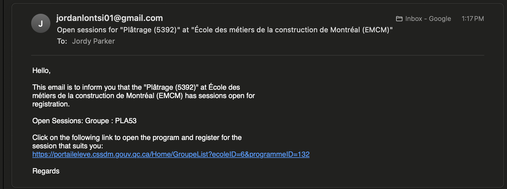

# Cssdm Scraping

This script scraps the website of the [Montreal School Service Center](https://portaileleve.cssdm.gouv.qc.ca/) for open groups for 
specific programs in specific schools and notifies users by email, allowing them to stay on top of programs they wish to enroll in and take advantage of them as soon as they open.

# Technology & tools
### 1. Python3
### 2. Beautiful Soup
### 3. [Gmail Api](https://developers.google.com/workspace/gmail/api/quickstart/python?hl=fr) quickstart guide with Python

# Installation

## 1. Prerequisites:
* To run this project, you'll need:
    * Python3 installed
    * Google Oauth2 credentials from your [Google Cloud Console](https://console.cloud.google.com/)'s project.
    
## 2. Project Setup:
* Clone or download the project from the repository.
* Extract the project files to a desired directory.

## 3. Install Dependencies:
* Open a terminal or command prompt and navigate to the project directory.
* Run the following commands to install the project dependencies:
    * ```python3 -m venv your_env_name && source your_env_name/bin/activate``` to create and active a virtual environment for the project (NB: This step is optional but recommended to avoid dependency conflicts with the global installed dependencies)
    * ```pip install -r requirements.txt``` to install the project dependencies listed in the ```requirements.txt``` file.

## 4. Environment Configuration:
* Create the ```.env``` file at the root of the project
* Copy the ```.env.example``` file and rename it to .env
* Open the ```.env``` file and configure your environment variables:
    * Set the school id, program ids (visit the [Montreal School Service Center](https://portaileleve.cssdm.gouv.qc.ca/)'s website, look for your programs and copy the schoolID and programmeId from the request url)
    * Set the sender and receiver of emails
* Download your Google Oauth2 credentials file from the GCP console, place it at the root of the project and rename it to ```credentials.json```.
  
## 5. Run the script:
* In the terminal, make sure you have navigated to where the project is found and run the following command to execute the script: 
    * ```python main.py```
* If the code run successfully, you'll receive and email that looks like this:



NB: To run this script periodically, you can deploy it on a server and set up a cron job that will run according to your preferences.
